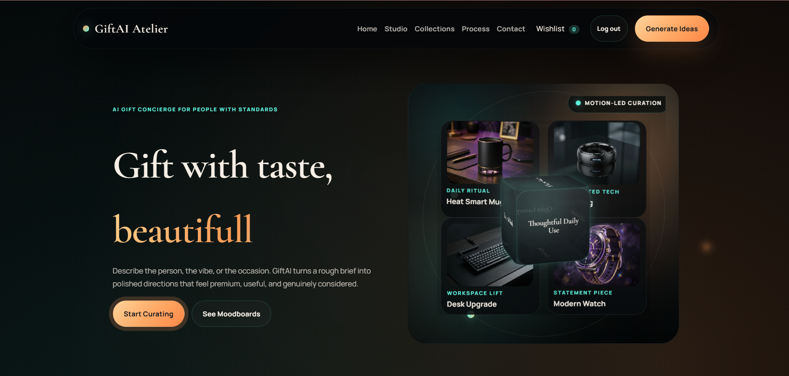
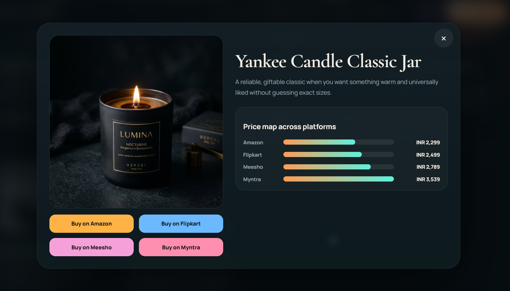
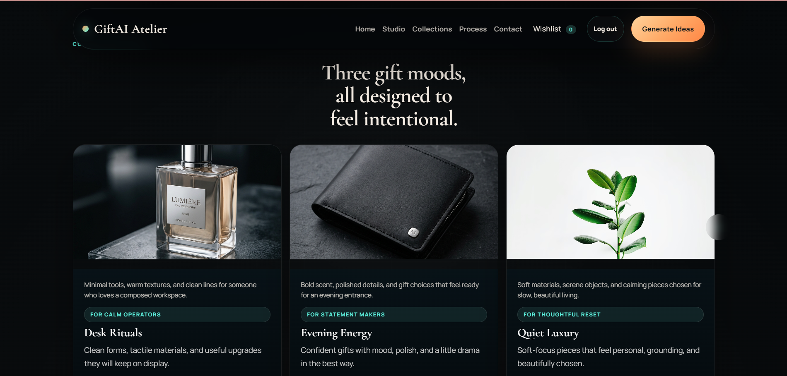
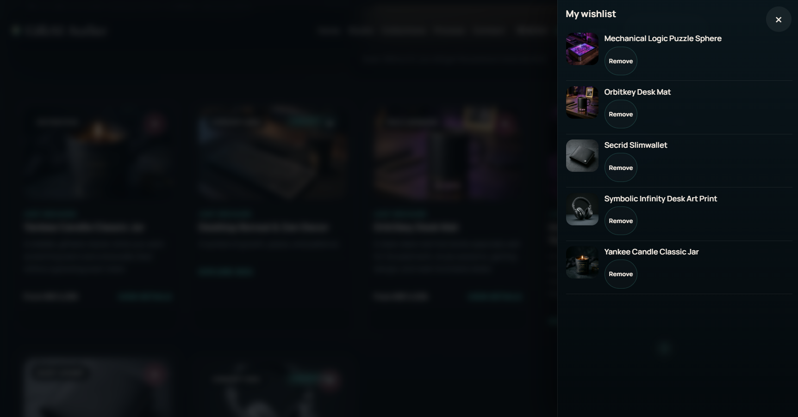
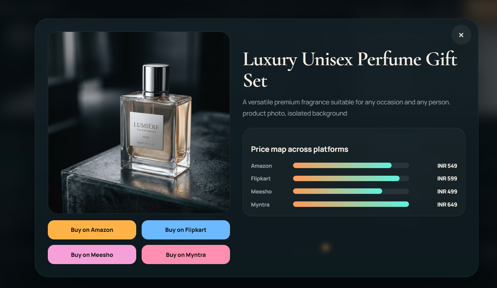
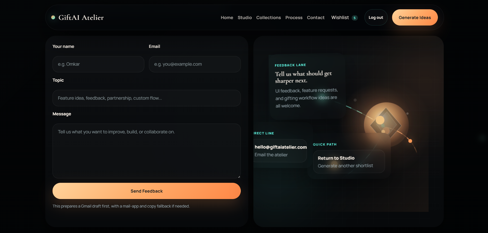

# GiftAI Atelier - AI Driven Gift Recommendation System

GiftAI Atelier is a full-stack web application that generates thoughtful gift recommendations from natural-language prompts, then helps users compare marketplace options and save favorites.

## Features

- Prompt-based gift recommendation flow
- Multi-provider AI orchestration with resilient fallback
- Curated fallback recommendations for demo stability
- Marketplace search links across Amazon, Flipkart, Meesho, and Myntra
- Price map comparison in product modal
- Firebase authentication and wishlist sync
- Responsive premium UI with animated hero experience

## Tech Stack

- Frontend: HTML, CSS, JavaScript, Vite
- Backend: Node.js, Express
- AI Providers: Groq, Gemini
- Fallback Engine: Curated rule-based recommendation set
- Auth + Data: Firebase (Auth + Firestore)

## AI Workflow

Provider order:

1. Groq
2. Gemini
3. Curated fallback engine

If Groq fails, the app automatically retries with Gemini. If both providers fail, the curated fallback engine guarantees usable recommendations.

## Recommendation Pipeline

1. Parse user prompt for recipient, interests, occasion, and budget signals.
2. Build recommendation context.
3. Request AI recommendations (Groq -> Gemini).
4. Normalize output shape.
5. Ensure marketplace links and prices are available.
6. Render cards and detailed modal with rationale and pricing.

## Marketplace Links and Price Comparison

Each recommendation includes:

- Marketplace links (`amazon`, `flipkart`, `meesho`, `myntra`)
- Marketplace prices for comparison in the modal
- Deterministic fallback handling for missing values

## Firebase Login and Wishlist

- Email/password sign-up and sign-in
- Save and remove wishlist items
- Session-aware wishlist rendering

## Local Setup

1. Clone the repository.
2. Install dependencies:
   - `npm install`
3. Create environment file:
   - Copy `.env.example` to `.env`
4. Add required keys in `.env`.
5. Start the app:
   - `npm run dev`
6. Open the app:
   - `http://localhost:5173`

## Environment Variables

Use `.env` (not committed):

- `GROQ_API_KEY`
- `GEMINI_API_KEY`
- `PORT` (default `8787`)

## Vercel Deployment

1. Push project to GitHub.
2. Import repository into Vercel.
3. Set environment variables in Vercel Project Settings:
   - `GROQ_API_KEY`
   - `GEMINI_API_KEY`
   - `PORT` (optional; defaults can be used)
4. Build command:
   - `npm run build`
5. Start command:
   - `npm run start`

## Scripts

- `npm run dev` - run API + Vite dev server
- `npm run build` - production build
- `npm run preview` - preview built app
- `npm run start` - alias for `npm run dev`

## Screenshots

